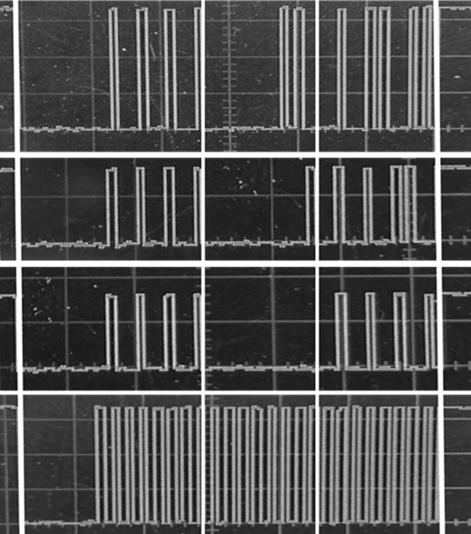
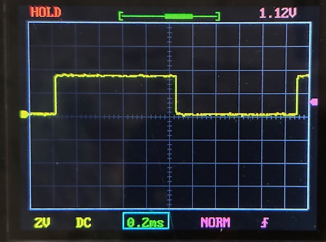
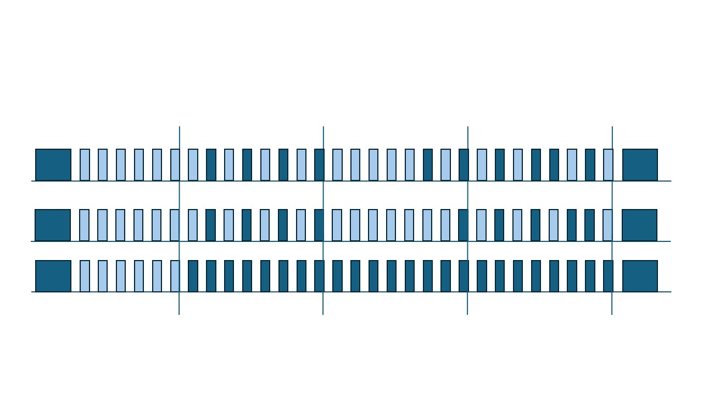

# Dalek-Head-Control

Controlling the head of the Hachette Partworks Dalek with a Pico Pi

The Hachette website is here:

https://hachettepartworks.com/en-en/dalek/

Datasheets:

| Item               | URL                                                                       |
| -------------------| --------------------------------------------------------------------------|
| AMS LM1117         | https://www.ti.com/lit/gpn/lm1117                                         |
| L9110S             | https://media.digikey.com/pdf/Data%20Sheets/UTD%20Semi%20PDFs/L9110S.pdf  |
| PIC12(L)F1571      | https://ww1.microchip.com/downloads/en/devicedoc/40001723d.pdf            |

## Background

If you build the head of the Hachette Partworks Dalek, and stop there, then you will need to devise a way to control the features:

- eye stalk up and down motor
- head rotate motor
- lamps
- eye stalk light

## Connectors in use

This is a useful reference site: https://www.mattmillman.com/info/crimpconnectors/common-jst-connector-types    


| Item               | Connector     | Number of pins |
| -------------------| --------------|----------------|
| Board power        | JST XH 2.54mm |  2             |
| Eye stalk motor    | JST PH 2.0mm  |  2             |
| Head rotate motor  | JST PH 2.0mm  |  2             |
| Lamps              | JST ZH 1.5mm  |  2             |
| Eye stalk light    | JST SH 1.0mm  |  4             |


## Exploring the test control board

The second issue comes with a test board which can be used with the dalek eye and the lights. This helps undestand how to control these aspects.
It has an AMS1117 3v power regulator.   
I think the IC is probably a PIC 12 of some variety. In the circuit diagram I have put PIC 12 pin numbers. It seems likely because the dalek eye light connections then are to RA0 and RA1, which can be USART output on that PIC (or SPI).   

The circuit is as below.

<p align="center">
  
</p>

## Exploring the full head circuit board

The circuit board for controlling the whole head comes in issue 12.   
This has twp connectors for the lights, two connectors for motors and one for the eye light.   
Plus a power / control connector.   
It has two ICs (U3 and U3) which are L9110S motor controllers.   
Another IC (unmarked) which is probably a larger, 16 pin PIC chip.   

## How to control the features

### Lamps

From inspecting the waveforms, the lamps are controlled with simple PWM and have a 430ohm resistor to limit curent.
This is basic Micropython to control one of the lamps on GPIO 0.

```
from machine import Pin, PWM
from time import sleep

# Lights

led = machine.Pin(0, Pin.OUT)
led_pwm = PWM(led)
duty_step = 500
frequency = 5000
led_pwm.freq(frequency)

def light_up(duty_step):
        for duty_cycle in range(0, 65535, duty_step):
            led_pwm.duty_u16(duty_cycle)
            sleep(0.005)

def light_down(duty_step):
        for duty_cycle in range(65535, 0, -duty_step):
            led_pwm.duty_u16(duty_cycle)
            sleep(0.005)

try:
    while True:
        light_up(500)
        light_down(500)

except KeyboardInterrupt:
    print("Keyboard interrupt")
    led_pwm.duty_u16(0)
    led_pwm.deinit()
    led.off()
```

### Eye stalk

This is Micropython code to control the eye stalk, with a L9110 attached to GPIO 4 and GPIO 5.

```
from machine import Pin, PWM
from time import sleep

up = machine.Pin(4, Pin.OUT)
down = machine.Pin(5, Pin.OUT)

up.on()
down.on()

def eye_stalk_up(dur):
        # Eye stalk up
        up.off()
        sleep(dur)
        up.on()
        
def eye_stalk_down(dur):
        down.off()
        sleep(dur)
        down.on()    

eye_stalk_up(1)

try:
    while True:
        eye_stalk_up(2)
        sleep(1)

        eye_stalk_down(2)
        sleep(1)


except KeyboardInterrupt:
    print("Keyboard interrupt")
    down.on()
    up.on()
```

### Head rotation

The head rotation is the same as the eye stalk control - a L9110 motor controller.

### Eye light

This is (I think) a non-standard synchronous waveform - not quite SPI, perhaps USART - but easy enough to replicated in Micropython.     
I used a basic oscilloscope (DSO 138) to explore the waveform - see below. This is showing the clock (lowest plot) and three different data waveforms.    
   

<p align="center">
  
</p>

There is a clock signal and data.    
The clock and data go low for a period (around 6 cycles) and then there are 24 data bits.     
At the end the clock and data signals go high again.   

The waveform period is 2.1ms, so the effective baud rate is 476 baud. 
Standard baud rates are 300 and 600.   
It works with rates between 460 and 850.   

<p align="center">
  
</p>

The command sequence in the 24 bits is:
```
0x55  header
0x??  command
0x??  checksum
```

The checksum is ```0x55 + command```.

Each command is one of the shapes the eye light can make.

```
0b0000_0000  off
0b0000_0001  on full
0b0000_0010  shape #1
0b0000_0011  shape #2
0b0000_0100  shape #3
0b0000_0101  shape #4
0b0000_0110  shape #5
```

Waveform showing two commands and the clock.   Light blue peaks are there to show the placing, but are at logic zero.   

<p align="center">
  
</p>


```
from machine import Pin
from time import ticks_us, sleep_us, sleep_ms

# Setup for receive
pin_clk  = Pin(18, mode=Pin.IN)
pin_data = Pin(16, mode=Pin.IN)

# Setup for send
pin_send_clk  = Pin(26, mode=Pin.OUT)
pin_send_data = Pin(27, mode=Pin.OUT)

# globals for send
baud = 600
cycle_dur = int(1_000_000 / baud) # length of a cycle in us
half_cycle = int(cycle_dur / 2)
front_porch = cycle_dur * 6

print(f"Setup with baud {baud}, cycle duration {cycle_dur}, half cycle {half_cycle} front porch {front_porch}")

def send_word(word):
    global baud, cycle_dur, half_cycle, front_porch

    pin_send_clk.value(0)
    pin_send_data.value(0)
    
    sleep_us(front_porch)

    for x in range(24):
        pin_send_data.value(word[x])
        sleep_us(100)
        pin_send_clk.value(1)
        sleep_us(half_cycle)
        pin_send_clk.value(0)
        sleep_us(100)
        pin_send_data.value(0)
        sleep_us(half_cycle)
        print(word[x], end="")
        
    pin_send_clk.value(1)
    pin_send_data.value(1)
    print()

def send():
    cmd_off = [0,1,0,1,0,1,0,1,  0,0,0,0,0,0,0,0,  0,1,0,1,0,1,0,1]
    cmd_on  = [0,1,0,1,0,1,0,1,  0,0,0,0,0,0,0,1,  0,1,0,1,0,1,1,0]
    cmd_2   = [0,1,0,1,0,1,0,1,  0,0,0,0,0,0,1,0,  0,1,0,1,0,1,1,1]
    cmd_3   = [0,1,0,1,0,1,0,1,  0,0,0,0,0,0,1,1,  0,1,0,1,1,0,0,0] 
    cmd_4   = [0,1,0,1,0,1,0,1,  0,0,0,0,0,1,0,0,  0,1,0,1,1,0,0,1] 
    cmd_5   = [0,1,0,1,0,1,0,1,  0,0,0,0,0,1,0,1,  0,1,0,1,1,0,1,0]
    cmd_6   = [0,1,0,1,0,1,0,1,  0,0,0,0,0,1,1,0,  0,1,0,1,1,0,1,1]
    
    cmds = [cmd_off, cmd_on, cmd_2, cmd_3, cmd_4, cmd_5, cmd_6,
            cmd_5, cmd_4, cmd_3, cmd_2, cmd_on, cmd_off]

    for cmd in cmds:
        send_word(cmd)
        sleep_ms(1000)
    
def send_repeat():
    while True:
        send() 
```

