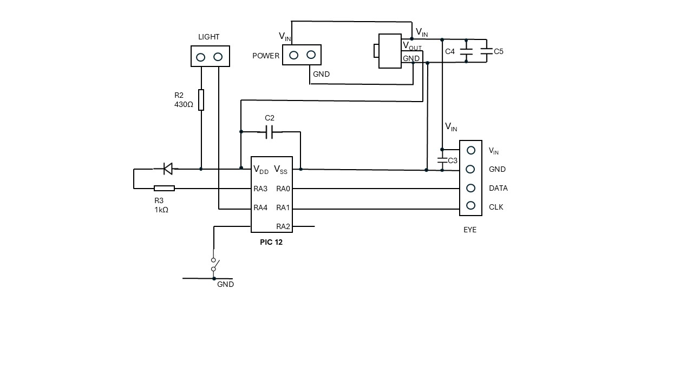

# Dalek-Head-Control

Controlling the head of the Hachette Partworks Dalek with a Pico Pi

The Hachette website is here:

https://hachettepartworks.com/en-en/dalek/

## Background

If you build the head of the Hachette Partworks Dalek, and stop there, then you will need to devise a way to control the features:

- eye stalk up and down motor
- head rotate motor
- lamps
- eye stalk light

## Exploring the test control board

The second issue comes with a test board which can be used with the dalek eye and the lights. This helps undestand how to control these aspects.
It has an AMS1117 3v power regulator.   
I think the IC is probably a PIC 12 of some variety.

The circuit is as below.

  

## Head circuit board

The circuit board for controlling the whole head comes in issue 12. 
This has twp connectors for the lights, two connectors for motors and one for the eye light.   Plus a power / control connector.
It has two ICs (U3 and U3) which are probably motor controllers
