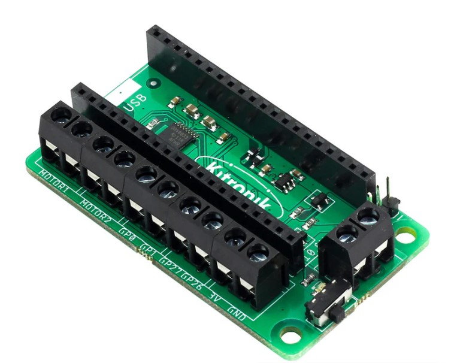

# Dalek-Head-Control

Controlling the head of the Hachette Partworks Dalek with a Pico Pi

Youtube video here: https://www.youtube.com/watch?v=uzwmANiXHF8    
On channel: https://www.youtube.com/@paulhamshere2652    

The Hachette website is here: https://hachettepartworks.com/en-en/dalek/    

**Datasheets**    

| Item               | URL                                                                       |
| -------------------| --------------------------------------------------------------------------|
| AMS LM1117         | https://www.ti.com/lit/gpn/lm1117                                         |
| L9110S             | https://media.digikey.com/pdf/Data%20Sheets/UTD%20Semi%20PDFs/L9110S.pdf  |
| PIC12(L)F1571      | https://ww1.microchip.com/downloads/en/devicedoc/40001723d.pdf            |

## Background

If you build the head of the Hachette Partworks Dalek, and stop there, then you will need to devise a way to control the features:

- eye stalk up and down motor
- head rotate motor
- lamps
- eye stalk light

## Connectors in use

This is a useful reference site: https://www.mattmillman.com/info/crimpconnectors/common-jst-connector-types    


| Item               | Connector     | Number of pins |
| -------------------| --------------|----------------|
| Board power        | JST XH 2.54mm |  2             |
| Eye stalk motor    | JST PH 2.0mm  |  2             |
| Head rotate motor  | JST PH 2.0mm  |  2             |
| Lamps              | JST ZH 1.5mm  |  2             |
| Eye stalk light    | JST SH 1.0mm  |  4             |


## Exploring the test control board

The second issue comes with a test board which can be used with the dalek eye and the lights. This helps undestand how to control these aspects.
It has an AMS1117 3v power regulator.   
I think the IC is probably a PIC 12 of some variety. In the circuit diagram I have put PIC 12 pin numbers. It seems likely because the dalek eye light connections then are to RA0 and RA1, which can be USART output on that PIC (or SPI).   

The circuit is as below.

<p align="center">
  
</p>

## Exploring the full head circuit board

The circuit board for controlling the whole head comes in issue 12.   
This has twp connectors for the lights, two connectors for motors and one for the eye light.   
Plus a power / control connector.   
It has two ICs (U3 and U3) which are L9110S motor controllers.   
Another IC (unmarked) which is probably a larger, 16 pin PIC chip.   

## How to control the features

### Lamps

From inspecting the waveforms, the lamps are controlled with simple PWM and have a 430ohm resistor to limit curent.
This is basic Micropython to control one of the lamps on GPIO 0.

The JST socket cable (mine, perhaps not all ones) matches the red socket to the black pin on the Dalek head, so the polarity needs to be swapped.   
This means that the red JST socket cable needs to be connected to the ground, and black to the +3v.  

<p align="center">
  
</p>

This code will receive the incoming data and show the 24 bits   

```
from machine import Pin, PWM
from time import sleep

# Lights

led = machine.Pin(0, Pin.OUT)
led_pwm = PWM(led)
duty_step = 500
frequency = 5000
led_pwm.freq(frequency)

def light_up(duty_step):
        for duty_cycle in range(0, 65535, duty_step):
            led_pwm.duty_u16(duty_cycle)
            sleep(0.005)

def light_down(duty_step):
        for duty_cycle in range(65535, 0, -duty_step):
            led_pwm.duty_u16(duty_cycle)
            sleep(0.005)

try:
    while True:
        light_up(500)
        light_down(500)

except KeyboardInterrupt:
    print("Keyboard interrupt")
    led_pwm.duty_u16(0)
    led_pwm.deinit()
    led.off()
```

### Eye stalk

This is Micropython code to control the eye stalk, with a L9110 attached to GPIO 4 and GPIO 5.

```
from machine import Pin, PWM
from time import sleep

up = machine.Pin(4, Pin.OUT)
down = machine.Pin(5, Pin.OUT)

up.on()
down.on()

def eye_stalk_up(dur):
        # Eye stalk up
        up.off()
        sleep(dur)
        up.on()
        
def eye_stalk_down(dur):
        down.off()
        sleep(dur)
        down.on()    

eye_stalk_up(1)

try:
    while True:
        eye_stalk_up(2)
        sleep(1)

        eye_stalk_down(2)
        sleep(1)


except KeyboardInterrupt:
    print("Keyboard interrupt")
    down.on()
    up.on()
```

### Head rotation

The head rotation is the same as the eye stalk control - a L9110 motor controller.

### Eye light

This is (I think) a non-standard synchronous waveform - not quite SPI, perhaps USART - but easy enough to replicated in Micropython.     
I used a basic oscilloscope (DSO 138) to explore the waveform - see below. This is showing the clock (lowest plot) and three different data waveforms.    
   

<p align="center">
  
</p>

There is a clock signal and data.    
The clock and data go low for a period (around 6 cycles) and then there are 24 data bits.     
At the end the clock and data signals go high again.   

The waveform period is 2.1ms, so the effective baud rate is 476 baud. 
Standard baud rates are 300 and 600.   
It works with rates between 460 and 850.   

<p align="center">
  
</p>

The command sequence in the 24 bits is:
```
0x55  header
0x??  command
0x??  checksum
```

The checksum is ```0x55 + command```.

Each command is one of the shapes the eye light can make.

```
0b0000_0000  off
0b0000_0001  on full
0b0000_0010  shape #1
0b0000_0011  shape #2
0b0000_0100  shape #3
0b0000_0101  shape #4
0b0000_0110  shape #5
```

Waveform showing two commands and the clock.   Light blue peaks are there to show the placing, but are at logic zero.   

<p align="center">
  
</p>


```
from machine import Pin
from time import ticks_us, sleep_us, sleep_ms

# Setup for receive
pin_clk  = Pin(18, mode=Pin.IN)
pin_data = Pin(16, mode=Pin.IN)
pin_led  = Pin(25, mode=Pin.OUT)

# globals for receive
led_toggle = False
data = [0] * 25
data_count = 0
last_rising= ticks_us()

def irq_handler_rising(pin):
    global led_toggle
    global data, data_count
    global last_rising
    
    this_rising = ticks_us()
    if this_rising - last_rising > 100_000:
        data_count = 0
       
    last_rising = this_rising
    
    if data_count <= 25:
        data[data_count] = pin_data.value()
    data_count += 1
    
    if led_toggle:
        led_toggle = False
        pin_led.off()
    else:
        led_toggle = True
        pin_led.on()

def receive():
    global data_count, data
    pin_clk.irq(trigger = Pin.IRQ_RISING, handler = irq_handler_rising)
    pin_led.on()

    try:
        while True:
            if data_count >= 25:
                for x in range(24):
                    print(data[x], end="")
                    if (x + 1) % 8 == 0:
                        print(" ", end ="")
                print()
                data_count = 0
        
    except KeyboardInterrupt:
        pin_led.off()
    # remove IRQ driver
    pin_clk.irq(None)

receive()
```

Sample code to cycle through the light patterns.   

```
from machine import Pin
from time import ticks_us, sleep_us, sleep_ms

# Setup for send
pin_send_clk  = Pin(26, mode=Pin.OUT)
pin_send_data = Pin(27, mode=Pin.OUT)

# globals for send
baud = 600
cycle_dur = int(1_000_000 / baud) # length of a cycle in us
half_cycle = int(cycle_dur / 2)
front_porch = cycle_dur * 6

print(f"Setup with baud {baud}, cycle duration {cycle_dur}, half cycle {half_cycle} front porch {front_porch}")

def send_word(word):
    global baud, cycle_dur, half_cycle, front_porch

    pin_send_clk.value(0)
    pin_send_data.value(0)
    
    sleep_us(front_porch)

    for x in range(24):
        pin_send_data.value(word[x])
        sleep_us(100)
        pin_send_clk.value(1)
        sleep_us(half_cycle)
        pin_send_clk.value(0)
        sleep_us(100)
        pin_send_data.value(0)
        sleep_us(half_cycle)
        print(word[x], end="")
        
    pin_send_clk.value(1)
    pin_send_data.value(1)
    print()

def send():
    cmd_off = [0,1,0,1,0,1,0,1,  0,0,0,0,0,0,0,0,  0,1,0,1,0,1,0,1]
    cmd_on  = [0,1,0,1,0,1,0,1,  0,0,0,0,0,0,0,1,  0,1,0,1,0,1,1,0]
    cmd_2   = [0,1,0,1,0,1,0,1,  0,0,0,0,0,0,1,0,  0,1,0,1,0,1,1,1]
    cmd_3   = [0,1,0,1,0,1,0,1,  0,0,0,0,0,0,1,1,  0,1,0,1,1,0,0,0] 
    cmd_4   = [0,1,0,1,0,1,0,1,  0,0,0,0,0,1,0,0,  0,1,0,1,1,0,0,1] 
    cmd_5   = [0,1,0,1,0,1,0,1,  0,0,0,0,0,1,0,1,  0,1,0,1,1,0,1,0]
    cmd_6   = [0,1,0,1,0,1,0,1,  0,0,0,0,0,1,1,0,  0,1,0,1,1,0,1,1]
    
    cmds = [cmd_off, cmd_on, cmd_2, cmd_3, cmd_4, cmd_5, cmd_6,
            cmd_5, cmd_4, cmd_3, cmd_2, cmd_on, cmd_off]

    for cmd in cmds:
        send_word(cmd)
        sleep_ms(1000)
    
def send_repeat():
    while True:
        send() 
```

Alternative version using timers    

<p align="center">
  
</p>

```
from machine import Pin, Timer
from time import sleep_ms

# Setup for send
pin_send_clk  = Pin(26, mode=Pin.OUT)
pin_send_data = Pin(27, mode=Pin.OUT)

baud = 600
porch_half_cycles = 6 * 2 # 6 full cycles
data_half_cycles = 24 * 2;  # 24 data bits
total_half_cycles = porch_half_cycles + data_half_cycles

print(f"Setup with baud {baud}, porch_half_cycles {porch_half_cycles} and total_half_cycles {total_half_cycles}")

# globals for the callback
data_value = 0
state = 0
count = 0
running = False

def timer_callback(timer):
    global porch_half_cycles
    global total_half_cycles
    
    global data_value
    global state
    global count
    global running

    if not running: # not primed to run yet
        return
 
    if state > total_half_cycles: # all done
        pin_send_data.value(1)
        pin_send_clk.value(1)
        running = False
        state = 0
        count = 0
        return
    
    if state == 0:
        pin_send_data.value(0)
        pin_send_clk.value(0)
    elif state > porch_half_cycles:  # keep zero for porch
        if state & 1 == 1:
            pin_send_data.value(data_value[count])
            pin_send_clk.value(1)   
            count += 1
        else:
            pin_send_clk.value(0)
            pin_send_data.value(0)
            
    state += 1


tim = Timer(mode=Timer.PERIODIC, freq = baud * 2, callback = timer_callback)

def send_with_timer(data):
    global data_value
    global state
    global count
    global running
    
    if not running:
        data_value = data
        running = True
    else:
        print("Called send_with_timer whilst data being sent")

cmd_off = [0,1,0,1,0,1,0,1,  0,0,0,0,0,0,0,0,  0,1,0,1,0,1,0,1]
cmd_on  = [0,1,0,1,0,1,0,1,  0,0,0,0,0,0,0,1,  0,1,0,1,0,1,1,0]
cmd_2   = [0,1,0,1,0,1,0,1,  0,0,0,0,0,0,1,0,  0,1,0,1,0,1,1,1]
cmd_3   = [0,1,0,1,0,1,0,1,  0,0,0,0,0,0,1,1,  0,1,0,1,1,0,0,0] 
cmd_4   = [0,1,0,1,0,1,0,1,  0,0,0,0,0,1,0,0,  0,1,0,1,1,0,0,1] 
cmd_5   = [0,1,0,1,0,1,0,1,  0,0,0,0,0,1,0,1,  0,1,0,1,1,0,1,0]
cmd_6   = [0,1,0,1,0,1,0,1,  0,0,0,0,0,1,1,0,  0,1,0,1,1,0,1,1]

cmds = [cmd_on, cmd_2, cmd_3, cmd_4, cmd_5, cmd_6,
        cmd_5, cmd_4, cmd_3, cmd_2, cmd_on, cmd_off]

try:
    while True:
        for c in cmds:
            send_with_timer(c)
            sleep_ms(500)
        
except KeyboardInterrupt:
    tim.deinit()
```

## Using the Kitronik Pico Pi Motor Driver Board

https://kitronik.co.uk/products/5331-kitronik-compact-motor-driver-board-for-raspberry-pi-pico

<p align="center">
  
</p>


<p align="center">
  
</p>

This code uses the Kitronik Pico Pi motor driver board and Bluetooth Midi (it was easiest and I had the code to hand) for Dalek head control.   


```
from machine import Pin, PWM
from time import ticks_us, sleep_us, sleep_ms, sleep 

#
# Dalek eye light
#

pin_send_clk  = Pin(0, mode=Pin.OUT)
pin_send_data = Pin(1, mode=Pin.OUT)

# globals for receive
led_toggle = False
data = [0] * 25
data_count = 0
last_rising= ticks_us()

# globals for send
baud = 600
cycle_dur = int(1_000_000 / baud) # length of a cycle in us
half_cycle = int(cycle_dur / 2)
front_porch = cycle_dur * 6


def send_word(word):
    global baud, cycle_dur, half_cycle, front_porch

    pin_send_clk.value(0)
    pin_send_data.value(0)
    sleep_us(front_porch)
    for x in range(24):
        pin_send_data.value(word[x])
        sleep_us(100)
        pin_send_clk.value(1)
        sleep_us(half_cycle)
        pin_send_clk.value(0)
        sleep_us(100)
        pin_send_data.value(0)
        sleep_us(half_cycle)
        
    pin_send_clk.value(1)
    pin_send_data.value(1)

cmd_off = [0,1,0,1,0,1,0,1,  0,0,0,0,0,0,0,0,  0,1,0,1,0,1,0,1]
cmd_on  = [0,1,0,1,0,1,0,1,  0,0,0,0,0,0,0,1,  0,1,0,1,0,1,1,0]
cmd_1   = [0,1,0,1,0,1,0,1,  0,0,0,0,0,0,1,0,  0,1,0,1,0,1,1,1]
cmd_2   = [0,1,0,1,0,1,0,1,  0,0,0,0,0,0,1,1,  0,1,0,1,1,0,0,0] 
cmd_3   = [0,1,0,1,0,1,0,1,  0,0,0,0,0,1,0,0,  0,1,0,1,1,0,0,1] 
cmd_4   = [0,1,0,1,0,1,0,1,  0,0,0,0,0,1,0,1,  0,1,0,1,1,0,1,0]
cmd_5   = [0,1,0,1,0,1,0,1,  0,0,0,0,0,1,1,0,  0,1,0,1,1,0,1,1]
    
eye_light_cmds = [cmd_off, cmd_on, cmd_1, cmd_2, cmd_3, cmd_4, cmd_5]
eye_light_widen = [cmd_5, cmd_4, cmd_3, cmd_2, cmd_1, cmd_on]
eye_light_narrow = [cmd_on, cmd_1, cmd_2, cmd_3, cmd_4, cmd_5]
    
def dalek_eye_light(num):
    send_word(eye_light_cmds[num])
    
def dalek_eye_light_cmd(cmd):
    send_word(cmd)

#
# Dalek lamps
#

led1 = machine.Pin(26, Pin.OUT)
led2 = machine.Pin(27, Pin.OUT)

led1_pwm = PWM(led1)
led2_pwm = PWM(led2)

frequency = 5000
led1_pwm.freq(frequency)
led2_pwm.freq(frequency)
light_max = 65535

def dalek_lamp1_brightness(duty_cycle):
    led1_pwm.duty_u16(duty_cycle)
    
def dalek_lamp2_brightness(duty_cycle):
    led2_pwm.duty_u16(duty_cycle)
    
def dalek_lamp1_off():
    led1_pwm.duty_u16(0)
    led1_pwm.deinit()
    led1.off()

def dalek_lamp2_off():
    led2_pwm.duty_u16(0)
    led2_pwm.deinit()
    led2.off()
   
#
# Dalek eye stalk motor
#

PWMFreq = 10000

motor1Forward=machine.PWM(machine.Pin(3))
motor1Reverse=machine.PWM(machine.Pin(2))
motor2Forward=machine.PWM(machine.Pin(6))
motor2Reverse=machine.PWM(machine.Pin(7))
motor1Forward.freq(PWMFreq)
motor1Reverse.freq(PWMFreq)
motor2Forward.freq(PWMFreq)
motor2Reverse.freq(PWMFreq)

def motorOn(motor, direction, speed):
    PWM = speed
    if motor == 1:
        if direction == "f":
            motor1Forward.duty_u16(PWM)
            motor1Reverse.duty_u16(0)
        elif direction == "r":
            motor1Forward.duty_u16(0)
            motor1Reverse.duty_u16(PWM)
    elif motor == 2:
        if direction == "f":
            motor2Forward.duty_u16(PWM)
            motor2Reverse.duty_u16(0)
        elif direction == "r":
            motor2Forward.duty_u16(0)
            motor2Reverse.duty_u16(PWM)

def motorOff(motor):
    motorOn(motor, "f", 0)

def dalek_eye_stalk_motor_on(direction, speed):
    speed = 65535 # max speed
    motorOn(1, direction, speed)
    
def dalek_eye_stalk_motor_off():
    motorOff(1)
   

def dalek_head_motor_on(direction, speed):
    motorOn(2, direction, speed)
    
def dalek_head_motor_off():
    motorOff(2)
   
##############################   
           
def test():
    try:
        while True:
            # test eye light
            print("Test eye light")
            for n in range(0, len(eye_light_cmds)):
                dalek_eye_light(n)
                sleep_ms(400)
            
            # test lamps
            print("Test lamps")
            step = 500
            for n in range(0, light_max, step):
                dalek_lamp1_brightness(n);
                dalek_lamp2_brightness(n);
                sleep_ms(10)
            for n in range(light_max, 0, -step):
                dalek_lamp1_brightness(n);
                dalek_lamp2_brightness(n);
                sleep_ms(10)
                
            dalek_lamp1_off()
            dalek_lamp2_off()
            
            print("Test eye stalk motor")
            # test eye stalk motor
            max_speed = 65535
            dalek_eye_stalk_motor_on("f", max_speed)
            sleep_ms(1000)
            dalek_eye_stalk_motor_on("r", max_speed)
            sleep_ms(1000)
            dalek_eye_stalk_motor_off()
            
    except KeyboardInterrupt:
        print("Keyboard interrupt")
        dalek_eye_stalk_motor_off()
        dalek_lamp1_off()
        dalek_lamp2_off()
        dalek_eye_light(0)
 
 
 
###########################
# Bluetooth section
###########################

from micropython import const
import struct
import bluetooth

_ADV_TYPE_FLAGS = const(0x01)
_ADV_TYPE_NAME = const(0x09)
_ADV_TYPE_UUID16_COMPLETE = const(0x3)
_ADV_TYPE_UUID32_COMPLETE = const(0x5)
_ADV_TYPE_UUID128_COMPLETE = const(0x7)
_ADV_TYPE_UUID16_MORE = const(0x2)
_ADV_TYPE_UUID32_MORE = const(0x4)
_ADV_TYPE_UUID128_MORE = const(0x6)
_ADV_TYPE_APPEARANCE = const(0x19)

#_ADV_TYPE_MANUFACTURER = const(0xff)

def advertising_payload(limited_disc=False, br_edr=False, name=None, services=None, appearance=0):
    payload = bytearray()

    def _append(adv_type, value):
        nonlocal payload
        payload += struct.pack("BB", len(value) + 1, adv_type) + value

    _append(
        _ADV_TYPE_FLAGS,
        struct.pack("B", (0x01 if limited_disc else 0x02) + (0x18 if br_edr else 0x04)),
    )

    if name:
        _append(_ADV_TYPE_NAME, name)

    if services:
        for uuid in services:
            b = bytes(uuid)
            if len(b) == 2:
                _append(_ADV_TYPE_UUID16_COMPLETE, b)
            elif len(b) == 4:
                _append(_ADV_TYPE_UUID32_COMPLETE, b)
            elif len(b) == 16:
                _append(_ADV_TYPE_UUID128_COMPLETE, b)

    # See org.bluetooth.characteristic.gap.appearance.xml
    if appearance:
        _append(_ADV_TYPE_APPEARANCE, struct.pack("<h", appearance))

    return payload


_IRQ_CENTRAL_CONNECT = const(1)
_IRQ_CENTRAL_DISCONNECT = const(2)
_IRQ_GATTS_WRITE = const(3)

_FLAG_READ = const(0x0002)
_FLAG_WRITE_NO_RESPONSE = const(0x0004)
_FLAG_WRITE = const(0x0008)
_FLAG_NOTIFY = const(0x0010)

"""
BLE_UUID = bluetooth.UUID("00000001-0000-1000-8000-010203040506")
BLE_TX = (
    bluetooth.UUID("00000001-0000-1000-8000-01020304050a"),
    _FLAG_READ | _FLAG_NOTIFY,
)
BLE_RX = (
    bluetooth.UUID("00000001-0000-1000-8000-01020304050b"),
    _FLAG_WRITE | _FLAG_WRITE_NO_RESPONSE,
)

BLE_SERVICE = (
    BLE_UUID,
    (BLE_TX, BLE_RX),
)
"""

_MIDI_IO = (
    bluetooth.UUID("7772E5DB-3868-4112-A1A9-F2669D106BF3"),
    bluetooth.FLAG_READ | bluetooth.FLAG_NOTIFY | bluetooth.FLAG_WRITE | bluetooth.FLAG_WRITE_NO_RESPONSE,
)

_MIDI_UUID = bluetooth.UUID("03B80E5A-EDE8-4B33-A751-6CE34EC4C700")
_MIDI_SERVICE = (
    _MIDI_UUID,
    (_MIDI_IO,),
)


class BLESimplePeripheral:
    def __init__(self, ble, name="dalek-head"):
        self._ble = ble
        self._ble.active(True)
        self._ble.irq(self._irq)
        ((self._handle_io,),) = self._ble.gatts_register_services((_MIDI_SERVICE,))
        self._ble.gatts_set_buffer(self._handle_io, 32, True)
        print("Handle ", self._handle_io)
        self._connections = set()
        self._write_callback = None
        self._payload = advertising_payload(name=name, services=[_MIDI_UUID])
        self._advertise()


    def _irq(self, event, data):
        # Track connections so we can send notifications.
        if event == _IRQ_CENTRAL_CONNECT:
            conn_handle, _, _ = data
            print("New connection", conn_handle)
            self._connections.add(conn_handle)
        elif event == _IRQ_CENTRAL_DISCONNECT:
            conn_handle, _, _ = data
            print("Disconnected", conn_handle)
            self._connections.remove(conn_handle)
            # Start advertising again to allow a new connection.
            self._advertise()
        elif event == _IRQ_GATTS_WRITE:
            conn_handle, value_handle = data
            value = self._ble.gatts_read(value_handle)
            if value_handle == self._handle_io and self._write_callback:
                self._write_callback(value)

    def send(self, data):
        for conn_handle in self._connections:
            self._ble.gatts_notify(conn_handle, self._handle_io, data)

    def is_connected(self):
        return len(self._connections) > 0

    def _advertise(self, interval_us=500000):
        print("Starting advertising")
        self._ble.gap_advertise(interval_us, adv_data=self._payload)

    def on_write(self, callback):
        self._write_callback = callback
        

def ble_dalek_control():
    ble = bluetooth.BLE()
    per = BLESimplePeripheral(ble)
    buf = []
    
    def on_rx(v):
        print("Received", ''.join('{:02x}'.format(x) for x in v))
        buf.append(v)

    per.on_write(on_rx)

    max_speed = 65535
    fast_speed = 50000

    while True:
        if buf:
            #rx_cmd = int(buf[0][0]) # get first byte of command
            rx_cmd = int(buf[0][-1]) # get last byte of the command
            print(rx_cmd)
            buf = []
            
            if rx_cmd == 10:
                print("Eye light on")
                dalek_eye_light_cmd(cmd_on)
            elif rx_cmd == 9:
                print("Eye light off")
                dalek_eye_light_cmd(cmd_off)
            elif rx_cmd == 12:
                print("Eye light widen")
                for c in eye_light_widen:
                    dalek_eye_light_cmd(c)
                    sleep_ms(300)
            elif rx_cmd == 11:
                print("Eye light narrow")
                for c in eye_light_narrow:
                    dalek_eye_light_cmd(c)
                    sleep_ms(300)
            elif rx_cmd == 7:
                print("Light flash slow")
                step = 500
                for n in range(0, light_max, step):
                    dalek_lamp1_brightness(n);
                    dalek_lamp2_brightness(n);
                    sleep_ms(5)
                for n in range(light_max, 0, -step):
                    dalek_lamp1_brightness(n);
                    dalek_lamp2_brightness(n);
                    sleep_ms(5)
                dalek_lamp1_off()
                dalek_lamp2_off()
            elif rx_cmd == 8:
                print("Light flash fast")
                step = 1000
                for n in range(0, light_max, step):
                    dalek_lamp1_brightness(n);
                    dalek_lamp2_brightness(n);
                    sleep_ms(5)
                for n in range(light_max, 0, -step):
                    dalek_lamp1_brightness(n);
                    dalek_lamp2_brightness(n);
                    sleep_ms(5)
                dalek_lamp1_off()
                dalek_lamp2_off()                
            elif rx_cmd == 4:
                print("Eye stalk up")
                dalek_eye_stalk_motor_on("r", max_speed)
                sleep_ms(1000)
                dalek_eye_stalk_motor_off()
            elif rx_cmd == 5:
                print("Eye stalk down")
                dalek_eye_stalk_motor_on("f", max_speed)
                sleep_ms(1000)
                dalek_eye_stalk_motor_off()
            elif rx_cmd == 6:
                print("Eye stalk stop")
                dalek_eye_stalk_motor_off()
            elif rx_cmd == 1:
                print("Head left")
		dalek_head_motor_on("f", fast_speed)
            elif rx_cmd == 2:
                print("Head right")
		dalek_head_motor_on("4", fast_speed)
            elif rx_cmd == 3:
                print("Head stop")
		dalek_head_motor_off()
            else:
                print("Invalid request")

# Choose normal test or bluetooth control

#test()
ble_dalek_control()
```
